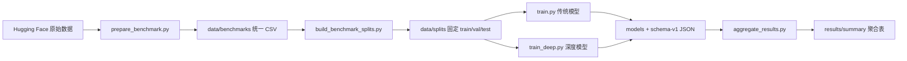

# AIGC Detection Research

面向中文与英文场景的可复现 AIGC 文本检测实验项目。项目统一接入 HC3-Chinese、HC3-English、MAGE 和 RAID，提供传统机器学习基线、预训练编码器、LoRA 微调、编码器与十二维风格特征融合、轻度扰动评测、结果聚合和 Streamlit 演示界面。

本仓库适合作为网络与信息安全课程实验、AIGC 文本检测原型和进一步研究的工程起点。它强调固定数据划分、配对样本防泄漏、结果文件可追溯以及人类文本误报风险，而不是把检测分数当作自动处分或定责依据。

## 目录

- [项目目标](#项目目标)
- [主要功能](#主要功能)
- [方法与实验矩阵](#方法与实验矩阵)
- [整体流程](#整体流程)
- [项目结构](#项目结构)
- [环境要求](#环境要求)
- [安装](#安装)
- [快速开始](#快速开始)
- [准备 Benchmark](#准备-benchmark)
- [构建固定数据划分](#构建固定数据划分)
- [运行传统模型](#运行传统模型)
- [运行深度模型](#运行深度模型)
- [批量实验与断点续跑](#批量实验与断点续跑)
- [结果聚合](#结果聚合)
- [模型推理](#模型推理)
- [启动 Demo](#启动-demo)
- [评价指标与结果格式](#评价指标与结果格式)
- [鲁棒性评测](#鲁棒性评测)
- [复现实验建议](#复现实验建议)
- [测试](#测试)
- [常见问题](#常见问题)
- [已知边界](#已知边界)
- [数据、模型与许可说明](#数据模型与许可说明)

## 项目目标

项目围绕以下问题组织实验：

1. 词级、字符级和风格统计特征能否构成有效的轻量 AIGC 检测基线。
2. Chinese RoBERTa 和 XLM-R 在中文、英文及跨领域数据上的检测能力如何。
3. 将显式风格特征与预训练编码器表示融合，是否能够稳定改善检测结果。
4. 空白归一化、连接词替换、标点删除和句子重排会怎样影响检测性能。
5. 模型对人类文本的误报率是否在不同领域和不同来源上保持可接受水平。
6. 数据划分、模型文件和结果指标能否通过哈希、随机种子和 JSON 记录进行追溯。

项目统一使用以下标签：

- `0`：人类文本，human。
- `1`：机器生成文本，machine/AIGC。

## 主要功能

- 接入 HC3-Chinese、HC3-English、MAGE 和 RAID。
- 将不同数据源转换为统一 CSV 字段。
- 对 HC3 和 RAID 按 `group_id` 构建 60%/20%/20% 分组划分。
- 对 MAGE 保留官方 train/validation/test 边界并进行类平衡抽样。
- 检查类别、重复文本和跨集合 group 泄漏。
- 提供 Word TF-IDF、Char TF-IDF、Style-LR 和 Hybrid-LR。
- 提供 Chinese RoBERTa 全参数微调。
- 提供 XLM-R + LoRA 微调。
- 提供 Encoder-only 与 Encoder + Style 消融实验。
- 按验证集 AUROC 保存最佳深度模型 checkpoint。
- 统一输出 Accuracy、F1、AUROC、Human FPR 等指标。
- 记录数据文件 SHA-256、运行环境、训练时间、推理时间和模型大小。
- 聚合多个随机种子的均值与样本标准差。
- 提供传统模型与深度模型的命令行推理。
- 提供传统 Hybrid-LR 的 Streamlit 演示界面。

## 方法与实验矩阵

### 传统模型

| 方法 | 特征 | 分类器 | 主要配置 |
|---|---|---|---|
| `word_tfidf` | 词级 TF-IDF | Logistic Regression | 1–2 gram，最多 50,000 特征 |
| `char_tfidf` | 字符级 TF-IDF | Logistic Regression | 2–5 gram，最多 80,000 特征 |
| `style` | 十二维风格统计 | Logistic Regression | StandardScaler，仅拟合训练集 |
| `hybrid` | 字符 TF-IDF + 词 TF-IDF + 风格统计 | Logistic Regression | 字符 60,000、词 30,000、十二维风格 |

所有传统模型使用 `class_weight="balanced"`、`solver="liblinear"` 和 `max_iter=2000`。

### 十二维风格特征

`StylometricTransformer` 提取：

1. 字符数 `char_len`。
2. token 数 `token_count`。
3. 句子数 `sentence_count`。
4. 平均 token 长度 `avg_token_len`。
5. 平均每句 token 数 `avg_sentence_tokens`。
6. 唯一 token 比例 `unique_token_ratio`。
7. 标点比例 `punct_ratio`。
8. 数字比例 `digit_ratio`。
9. 大写字符比例 `upper_ratio`。
10. 换行比例 `newline_ratio`。
11. 逗号比例 `comma_ratio`。
12. 引号比例 `quote_ratio`。

### 深度模型

| Benchmark | 默认编码器 | 默认微调方式 | 输出方法名 |
|---|---|---|---|
| `hc3_zh` | `hfl/chinese-roberta-wwm-ext` | Full fine-tuning | `roberta_encoder` / `roberta_style` |
| `hc3` | `xlm-roberta-base` | LoRA | `xlmr_encoder` / `xlmr_style` |
| `mage` | `xlm-roberta-base` | LoRA | `xlmr_encoder` / `xlmr_style` |
| `raid` | `xlm-roberta-base` | LoRA | `xlmr_encoder` / `xlmr_style` |

深度分类头结构为：

```text
CLS representation
    [+ 12 standardized style features in fusion mode]
        -> LayerNorm
        -> Dropout(0.1)
        -> Linear(hidden_dim=256)
        -> GELU
        -> Dropout(0.1)
        -> Linear(2)
```

LoRA 默认配置：

- `r=8`
- `alpha=16`
- `dropout=0.1`
- target modules：`query`、`value`
- task type：`FEATURE_EXTRACTION`

### 批量实验规模

默认 `course` profile 生成：

- 传统模型：4 benchmarks × 4 methods × 3 seeds = 48 个任务。
- 深度模型：4 benchmarks × 2 modes × 1 seed = 8 个任务。
- 总计：56 个任务。

深度模型默认只运行 seed 42；如果需要正式论文级结论，应手工补充更多随机种子、置信区间和显著性检验。

## 整体流程



推荐顺序是：

1. 安装基础依赖和深度学习依赖。
2. 运行数据转换器自测。
3. 下载并转换 benchmark。
4. 构建固定划分并检查 manifest。
5. 使用 `--dry-run` 检查实验矩阵。
6. 先运行传统模型。
7. 对深度模型进行 100 样本 GPU 烟测。
8. 运行正式深度实验。
9. 聚合 JSON 结果。
10. 从聚合产物填写报告，不手工抄写终端输出。

## 项目结构

```text
aigc-detection-research/
├─ README.md
├─ demo/
│  └─ app.py                         # Streamlit 演示界面
├─ docs/
│  ├─ benchmark_guide.md             # Benchmark 接入说明
│  ├─ deep_learning_guide.md         # 深度模型运行建议
│  └─ research_direction.md          # 研究方向说明
├─ figures/
│  └─ data-manifest.md
├─ scripts/
│  ├─ prepare_benchmark.py           # 下载并统一数据格式
│  ├─ build_benchmark_splits.py      # 构建固定数据划分
│  ├─ run_experiments.py             # 批量运行实验矩阵
│  ├─ train_deep.py                  # 训练编码器/融合模型
│  ├─ predict_deep.py                # 深度 checkpoint 推理
│  └─ aggregate_results.py           # 聚合 schema-v1 JSON
├─ src/aigc_detector/
│  ├─ attacks.py                     # 四类轻度文本扰动
│  ├─ data_utils.py                  # CSV 加载与基础切分
│  ├─ deep_models.py                 # 编码器、LoRA、checkpoint
│  ├─ evaluate.py                    # 指标与分组评测
│  ├─ explain.py                     # 线性模型特征解释
│  ├─ features.py                    # 十二维风格特征
│  ├─ models.py                      # 传统模型定义
│  ├─ predict.py                     # 传统模型推理
│  ├─ result_utils.py                # 哈希、环境与 JSON 工具
│  └─ train.py                       # 传统模型训练入口
├─ tables/
│  └─ table-schema.md
└─ tests/
   └─ test_core.py
```

运行后还会生成：

```text
data/
├─ benchmarks/                       # 统一格式的 benchmark CSV
└─ splits/<benchmark>/
   ├─ train.csv
   ├─ val.csv
   ├─ test.csv
   └─ manifest.json

models/
├─ <benchmark>/<traditional_method>/seed_<seed>.joblib
└─ deep/<benchmark>/<deep_method>/seed_<seed>/

results/
├─ <benchmark>/<method>/seed_<seed>.json
└─ summary/
   ├─ raw_main_results.csv
   ├─ raw_robustness_results.csv
   ├─ main_results.csv
   ├─ robustness_results.csv
   ├─ main_results.md
   ├─ robustness_results.md
   └─ ablation_results.md
```

`data/`、`models/` 和 `results/` 默认不纳入版本控制，需要在每台机器上重新生成或通过独立的制品存储分发。

## 环境要求

### 基础实验

- Windows、Linux 或 macOS。
- Python 3.10 及以上；当前项目已在 Python 3.12.13 上验证。
- 足够容纳 benchmark CSV 的磁盘空间。
- 下载 Hugging Face 数据集时需要互联网连接。

### 深度实验

- 推荐 NVIDIA GPU。
- 推荐至少 6 GB 显存进行项目提供的默认烟测；完整训练的可行 batch size 取决于 GPU、CUDA、模型和输入长度。
- 首次加载 `xlm-roberta-base` 或 Chinese RoBERTa 时需要下载权重。XLM-R 基础权重约为 1 GB 量级，应预留缓存空间。
- CUDA 版 PyTorch 必须与本机显卡驱动兼容。

### 已验证环境

以下组合已经在当前项目上通过单元测试以及 XLM-R + Style + LoRA 的 100 样本完整烟测：

| Package | Version |
|---|---:|
| Python | 3.12.13 |
| PyTorch | 2.5.0+cu121 |
| Transformers | 4.44.0 |
| PEFT | 0.19.1 |
| Accelerate | 1.14.0 |
| safetensors | 0.8.0 |
| NumPy | 2.4.6 |
| pandas | 3.0.3 |
| scikit-learn | 1.9.0 |
| joblib | 1.5.3 |
| datasets | 3.6.0 |
| Streamlit | 1.58.0 |

这张表记录的是已验证组合，不代表所有版本都必须完全相同。由于仓库当前没有依赖锁文件，升级 PyTorch、Transformers 或 PEFT 后应重新运行深度烟测。

## 安装

### 1. 创建 Conda 环境

在 PowerShell 中执行：

```powershell
conda create -n aigcdetect python=3.12 -y
conda activate aigcdetect
python -m pip install --upgrade pip
```

如果已经存在环境：

```powershell
conda activate aigcdetect
python --version
```

### 2. 安装基础依赖

```powershell
python -m pip install numpy pandas scikit-learn joblib
```

下载 benchmark 需要：

```powershell
python -m pip install datasets
```

运行 Demo 需要：

```powershell
python -m pip install streamlit
```

### 3. 安装 PyTorch

应根据本机 CUDA 和显卡驱动选择 PyTorch。当前已验证环境使用 CUDA 12.1 对应的 PyTorch 2.5.0：

```powershell
python -m pip install torch==2.5.0 --index-url https://download.pytorch.org/whl/cu121
```

这只是与当前验证环境一致的示例。如果本机没有兼容的 NVIDIA GPU，请安装 CPU 版本；如果 CUDA 版本不同，请使用与本机驱动兼容的 PyTorch wheel。

安装后确认：

```powershell
python -c "import torch; print(torch.__version__); print('cuda_available=', torch.cuda.is_available()); print('cuda=', torch.version.cuda)"
```

### 4. 安装深度模型依赖

```powershell
python -m pip install transformers peft accelerate safetensors sentencepiece
```

如需复现当前已验证的核心版本，可使用：

```powershell
python -m pip install transformers==4.44.0 peft==0.19.1 accelerate==1.14.0 safetensors==0.8.0
```

### 5. 验证导入

```powershell
python -c "import numpy, pandas, sklearn, joblib; print('classical dependencies: OK')"
python -c "import torch, transformers, peft, accelerate, safetensors; print('deep dependencies: OK')"
```

> 当前仓库没有 `requirements.txt`、`requirements-deep.txt` 或环境锁文件。部分代码中的历史错误提示仍可能提到 `requirements-deep.txt`；在依赖文件补齐前，请使用本节命令安装。

## 快速开始

以下流程以 HC3-Chinese 和传统模型为例，适合第一次运行项目。

### 1. 进入项目目录

```powershell
cd D:\网络与信息安全\aigc-detection-research
conda activate aigcdetect
```

### 2. 运行数据适配器自测

```powershell
python scripts/prepare_benchmark.py --self-test
```

预期输出包含：

```text
BENCHMARK ADAPTER SELF-TEST: OK
```

### 3. 准备 HC3-Chinese

```powershell
python scripts/prepare_benchmark.py `
  --dataset hc3_zh `
  --split train `
  --max-per-class 5000 `
  --output data/benchmarks/hc3_zh_train.csv
```

### 4. 构建固定划分

```powershell
python scripts/build_benchmark_splits.py --benchmark hc3_zh --seed 42
```

检查：

```powershell
Get-Content data/splits/hc3_zh/manifest.json -Encoding UTF8
```

### 5. 训练一个 Char TF-IDF 基线

```powershell
python src/aigc_detector/train.py `
  --data data/splits/hc3_zh/train.csv `
  --val-data data/splits/hc3_zh/val.csv `
  --test-data data/splits/hc3_zh/test.csv `
  --benchmark hc3_zh `
  --model char_tfidf `
  --seed 42 `
  --robust `
  --out models/hc3_zh/char_tfidf/seed_42.joblib `
  --metrics results/hc3_zh/char_tfidf/seed_42.json
```

### 6. 查看结果

```powershell
Get-Content results/hc3_zh/char_tfidf/seed_42.json -Encoding UTF8
```

## 准备 Benchmark

### 统一字段

`prepare_benchmark.py` 输出以下字段：

| 字段 | 含义 |
|---|---|
| `text` | 待检测文本 |
| `label` | `0=human`，`1=machine` |
| `domain` | 领域、体裁或任务来源 |
| `source` | `human` 或生成模型名称 |
| `attack` | `none`、`paraphrase` 或数据源中的攻击名称 |
| `group_id` | 防止关联样本跨集合泄漏的分组标识 |
| `benchmark` | `hc3_zh`、`hc3`、`mage` 或 `raid` |
| `split` | 原始数据源的 split 名称 |

转换器还会：

- 去除空文本。
- 按 `--min-chars` 过滤短文本，默认 50 字符。
- 对完全相同文本去重。
- 按类别限制最大样本数。
- 在 streaming 模式下使用固定 seed 和 10,000 条 shuffle buffer。

### HC3-Chinese

```powershell
python scripts/prepare_benchmark.py `
  --dataset hc3_zh `
  --split train `
  --max-per-class 5000 `
  --seed 42 `
  --output data/benchmarks/hc3_zh_train.csv
```

HC3 中同一问题可能对应多个人类答案和一个机器答案。转换器根据问题内容生成相同 `group_id`，后续划分时整组放入同一集合。

### HC3-English

```powershell
python scripts/prepare_benchmark.py `
  --dataset hc3 `
  --split train `
  --max-per-class 5000 `
  --seed 42 `
  --output data/benchmarks/hc3_en_train.csv
```

### MAGE

```powershell
python scripts/prepare_benchmark.py --dataset mage --split train --max-per-class 3000 --seed 42 --output data/benchmarks/mage_train.csv
python scripts/prepare_benchmark.py --dataset mage --split validation --max-per-class 1000 --seed 42 --output data/benchmarks/mage_validation.csv
python scripts/prepare_benchmark.py --dataset mage --split test --max-per-class 1000 --seed 42 --output data/benchmarks/mage_test.csv
```

注意：MAGE 原始标签定义与本项目相反。转换器会在 `convert_mage` 中翻转标签，使项目内部始终保持 `0=human`、`1=machine`。不要跳过转换器直接把原始 MAGE 标签交给训练脚本。

### RAID

```powershell
python scripts/prepare_benchmark.py `
  --dataset raid `
  --split train `
  --max-per-class 5000 `
  --raid-english `
  --attacks none `
  --seed 42 `
  --output data/benchmarks/raid_train.csv
```

`--raid-english` 只保留以下规范化领域：

- abstracts
- books
- news
- reviews
- reddit
- recipes
- wikipedia
- poetry

`--attacks none` 用于准备 clean 子集。RAID 官方无标签测试集不能用于本地 Accuracy 或 AUROC 计算，因此本项目课程 profile 使用带标签的 train 子集构建本地划分。

### 过滤领域和攻击

```powershell
python scripts/prepare_benchmark.py `
  --dataset raid `
  --split train `
  --domains news,reviews,wikipedia `
  --attacks none `
  --raid-english `
  --output data/benchmarks/raid_filtered.csv
```

### 非 streaming 下载

默认开启 streaming。如果数据源或网络环境不适合 streaming：

```powershell
python scripts/prepare_benchmark.py --dataset hc3_zh --split train --no-streaming --output data/benchmarks/hc3_zh_train.csv
```

非 streaming 模式通常需要更多磁盘和内存。

## 构建固定数据划分

### 构建全部 benchmark

```powershell
python scripts/build_benchmark_splits.py --profile course --seed 42
```

### 只构建一个 benchmark

```powershell
python scripts/build_benchmark_splits.py --benchmark hc3_zh --seed 42
```

### 自定义输入和输出目录

```powershell
python scripts/build_benchmark_splits.py `
  --benchmark hc3 `
  --input-dir D:\datasets\aigc-normalized `
  --output-dir D:\datasets\aigc-splits `
  --seed 42
```

### 划分规则

| Benchmark | 输入规模 | 划分方式 |
|---|---:|---|
| HC3-Chinese | 5,000 human + 5,000 machine | `group_id` 约 60%/20%/20% |
| HC3-English | 5,000 human + 5,000 machine | `group_id` 约 60%/20%/20% |
| MAGE | train 6,000；val 2,000；test 2,000 | 保留官方集合边界 |
| RAID | 5,000 human + 5,000 machine | `group_id` 约 60%/20%/20% |

构建器会检查：

- 每个集合同时包含标签 0 和 1。
- 每个集合内部不存在重复文本。
- 类别比例差不超过允许范围。
- train、val、test 的 `group_id` 交集为空。
- train、val、test 的文本交集为空。
- 相同 seed 重建时分组结果可复现。

### Manifest

每个 benchmark 的 `manifest.json` 包含：

- profile、benchmark 和 seed。
- 原始统一 CSV 的路径与 SHA-256。
- 每个 split 的路径、行数、标签数、group 数和 SHA-256。

在正式训练前应保存并检查 manifest。重新生成 split 后，旧模型和旧结果 JSON 不应继续用于同一张结果表。

## 运行传统模型

### 使用固定 train/val/test

```powershell
python src/aigc_detector/train.py `
  --data data/splits/hc3/train.csv `
  --val-data data/splits/hc3/val.csv `
  --test-data data/splits/hc3/test.csv `
  --benchmark hc3 `
  --model hybrid `
  --seed 42 `
  --threshold 0.5 `
  --robust `
  --out models/hc3/hybrid/seed_42.joblib `
  --metrics results/hc3/hybrid/seed_42.json
```

### 从单个池文件临时切分

```powershell
python src/aigc_detector/train.py `
  --data data/benchmarks/hc3_zh_train.csv `
  --model hybrid `
  --test-size 0.25 `
  --seed 42 `
  --out models/hc3_zh_hybrid.joblib `
  --metrics results/hc3_zh_metrics.json
```

如果输入包含重复 `group_id`，脚本会使用 GroupShuffleSplit；否则使用普通 train/test split，并在可能时按标签分层。

单池切分适合原型或烟测，不应与统一固定划分的正式结果混入同一张主表。

### 可选模型名

```text
word_tfidf
char_tfidf
style
hybrid
```

## 运行深度模型

### 正式训练参数

深度训练入口：

```powershell
python scripts/train_deep.py --help
```

必须提供：

- `--benchmark`
- `--train-data`
- `--val-data`
- `--test-data`
- `--mode`
- `--out`
- `--metrics`

### Chinese RoBERTa Encoder-only

```powershell
python scripts/train_deep.py `
  --benchmark hc3_zh `
  --train-data data/splits/hc3_zh/train.csv `
  --val-data data/splits/hc3_zh/val.csv `
  --test-data data/splits/hc3_zh/test.csv `
  --mode encoder `
  --seed 42 `
  --epochs 3 `
  --robust `
  --out models/deep/hc3_zh/roberta_encoder/seed_42 `
  --metrics results/hc3_zh/roberta_encoder/seed_42.json
```

`hc3_zh` 默认使用：

- full fine-tuning
- batch size 8
- gradient accumulation 2
- learning rate 2e-5
- max length 256

### Chinese RoBERTa + Style

```powershell
python scripts/train_deep.py `
  --benchmark hc3_zh `
  --train-data data/splits/hc3_zh/train.csv `
  --val-data data/splits/hc3_zh/val.csv `
  --test-data data/splits/hc3_zh/test.csv `
  --mode fusion `
  --seed 42 `
  --epochs 3 `
  --robust `
  --out models/deep/hc3_zh/roberta_style/seed_42 `
  --metrics results/hc3_zh/roberta_style/seed_42.json
```

### XLM-R + LoRA Encoder-only

```powershell
python scripts/train_deep.py `
  --benchmark hc3 `
  --train-data data/splits/hc3/train.csv `
  --val-data data/splits/hc3/val.csv `
  --test-data data/splits/hc3/test.csv `
  --mode encoder `
  --seed 42 `
  --epochs 3 `
  --robust `
  --out models/deep/hc3/xlmr_encoder/seed_42 `
  --metrics results/hc3/xlmr_encoder/seed_42.json
```

### XLM-R + LoRA + Style

```powershell
python scripts/train_deep.py `
  --benchmark hc3 `
  --train-data data/splits/hc3/train.csv `
  --val-data data/splits/hc3/val.csv `
  --test-data data/splits/hc3/test.csv `
  --mode fusion `
  --seed 42 `
  --epochs 3 `
  --robust `
  --out models/deep/hc3/xlmr_style/seed_42 `
  --metrics results/hc3/xlmr_style/seed_42.json
```

XLM-R 默认使用：

- LoRA
- batch size 4
- gradient accumulation 4
- learning rate 1e-4
- max length 256

### 覆盖默认编码器或微调方式

```powershell
python scripts/train_deep.py `
  --benchmark hc3 `
  --train-data data/splits/hc3/train.csv `
  --val-data data/splits/hc3/val.csv `
  --test-data data/splits/hc3/test.csv `
  --mode encoder `
  --encoder xlm-roberta-base `
  --tuning full `
  --batch-size 2 `
  --gradient-accumulation 8 `
  --learning-rate 2e-5 `
  --out models/deep-custom/hc3-full `
  --metrics results/deep-custom/hc3-full.json
```

### GPU 烟测

在正式训练前，至少运行一次 100 样本、1 epoch 烟测。

Chinese RoBERTa：

```powershell
python scripts/train_deep.py --benchmark hc3_zh --train-data data/splits/hc3_zh/train.csv --val-data data/splits/hc3_zh/val.csv --test-data data/splits/hc3_zh/test.csv --mode encoder --epochs 1 --max-train-samples 100 --max-eval-samples 100 --out models/deep-smoke/hc3_zh_encoder --metrics results/deep-smoke/hc3_zh_encoder.json
```

XLM-R + Style + LoRA：

```powershell
python scripts/train_deep.py --benchmark hc3 --train-data data/splits/hc3/train.csv --val-data data/splits/hc3/val.csv --test-data data/splits/hc3/test.csv --mode fusion --epochs 1 --max-train-samples 100 --max-eval-samples 100 --out models/deep-smoke/hc3_xlmr_style --metrics results/deep-smoke/hc3_xlmr_style.json
```

烟测应覆盖：

- tokenizer 和基础模型下载/缓存。
- LoRA adapter 注入。
- 前向与反向传播。
- validation AUROC 计算。
- 最佳 checkpoint 保存。
- checkpoint 重新加载。
- test 推理。

烟测产物只能用于验证流程，不能作为正式实验结果。

### 深度 checkpoint 内容

Full fine-tuning checkpoint 通常包含：

```text
encoder/                     # 完整编码器权重与 config
tokenizer/                   # tokenizer 文件
classifier.pt                # 项目自定义分类头
model_spec.json              # 编码器、融合和 LoRA 配置
style_scaler.joblib          # 仅 fusion 模式存在
```

LoRA checkpoint 的 `encoder/` 主要包含：

```text
adapter_config.json
adapter_model.safetensors
```

LoRA checkpoint 不包含完整 XLM-R 基础权重。重新加载时仍需本地 Hugging Face 缓存或网络访问。因此 LoRA 目录大小不能直接视为完整部署模型大小。

## 批量实验与断点续跑

### 查看全部任务但不执行

```powershell
python scripts/run_experiments.py --profile course --dry-run
```

### 运行全部任务

```powershell
python scripts/run_experiments.py --profile course
```

全部任务包含完整深度训练，运行时间和存储开销可能很大。建议先分 benchmark、分 family 执行。

### 只运行传统模型

```powershell
python scripts/run_experiments.py --profile course --families classical --resume
```

### 只运行深度模型

```powershell
python scripts/run_experiments.py --profile course --families deep --resume
```

### 只运行指定 benchmark

```powershell
python scripts/run_experiments.py --profile course --benchmarks hc3_zh --families classical --resume
python scripts/run_experiments.py --profile course --benchmarks hc3,mage --families deep --resume
```

### `--resume` 的行为

当目标 JSON 满足以下条件时，任务被跳过：

- `schema_version == 1`
- 包含 `overall`
- 包含 `checkpoint`

当前实现不会进一步检查 checkpoint 是否仍然存在，也不会把当前 split 哈希与旧结果自动比较。因此在以下情况后应删除或归档旧 JSON，再重新运行：

- 重新生成了数据 split。
- 修改了模型结构或超参数默认值。
- 删除或损坏了 checkpoint。
- 更换了基础模型或依赖版本。

### 批量运行的输出行为

当前 `run_experiments.py` 使用 `capture_output=True` 启动子进程。深度训练期间，子进程的进度条可能不会实时显示；失败时脚本会打印捕获到的 stdout/stderr 并抛出 `CalledProcessError`。如果需要实时观察训练，可直接运行对应的 `train_deep.py` 命令。

## 结果聚合

运行：

```powershell
python scripts/aggregate_results.py
```

自定义目录：

```powershell
python scripts/aggregate_results.py `
  --results-dir D:\experiments\aigc-results `
  --output-dir D:\experiments\aigc-summary
```

聚合器读取：

```text
results/<benchmark>/<method>/seed_*.json
```

并生成：

| 文件 | 内容 |
|---|---|
| `raw_main_results.csv` | 每个 seed 的主结果 |
| `raw_robustness_results.csv` | 每个 seed、每种攻击的结果 |
| `main_results.csv` | benchmark/method 的均值与标准差 |
| `robustness_results.csv` | benchmark/method/attack 的均值与标准差 |
| `main_results.md` | Markdown 主结果表 |
| `robustness_results.md` | Markdown 鲁棒性表 |
| `ablation_results.md` | Style、Encoder、Encoder + Style 消融表 |

有多个 seed 时，聚合器使用样本标准差 `ddof=1`，格式为：

```text
mean ± std
```

只有一个 seed 时，只输出单个四位小数值。

## 模型推理

### 传统模型

```powershell
python src/aigc_detector/predict.py `
  --model models/hc3_zh/char_tfidf/seed_42.joblib `
  --text "本文围绕网络与信息安全中的AIGC内容鉴别问题展开分析。"
```

请求线性模型解释：

```powershell
python src/aigc_detector/predict.py `
  --model models/hc3_zh/hybrid/seed_42.joblib `
  --text "待检测文本" `
  --explain
```

输出包括：

- `ai_probability`
- `predicted_label`
- `risk_band`
- 可选的特征解释

风险区间：

| AI 概率 | 风险区间 |
|---:|---|
| `<= 0.25` | `low_ai_risk` |
| `0.25–0.75` | `uncertain_review_needed` |
| `>= 0.75` | `high_ai_risk` |

分类标签仍以 0.5 为默认阈值。

### 深度模型

```powershell
python scripts/predict_deep.py `
  --checkpoint models/deep/hc3/xlmr_style/seed_42 `
  --text "This is the text to be evaluated." `
  --max-length 256
```

Fusion checkpoint 会自动加载 `style_scaler.joblib` 并重新计算十二维风格特征。LoRA checkpoint 加载时还需要 `model_spec.json` 中指定的基础编码器。

## 启动 Demo

Demo 默认寻找：

```text
models/hybrid.joblib
```

如果不存在，则尝试用：

```text
data/sample_dataset.csv
```

临时训练演示模型。由于 `models/` 和 `data/` 默认被 Git 忽略，干净克隆后必须先准备至少其中之一。

推荐从固定 split 训练 Demo 模型：

```powershell
python src/aigc_detector/train.py `
  --data data/splits/hc3_zh/train.csv `
  --val-data data/splits/hc3_zh/val.csv `
  --test-data data/splits/hc3_zh/test.csv `
  --benchmark hc3_zh `
  --model hybrid `
  --out models/hybrid.joblib `
  --metrics results/demo_hybrid.json
```

启动：

```powershell
streamlit run demo/app.py
```

Demo 展示：

- AI 概率。
- 风险等级。
- 人工复核建议。
- 线性模型的主要贡献特征。

Demo 目前只加载 joblib 格式的传统模型，不加载深度 checkpoint。

## 评价指标与结果格式

### 主指标

| 指标 | 含义 |
|---|---|
| Accuracy | 全部样本分类正确率 |
| Precision | 被预测为机器文本的样本中，实际为机器文本的比例 |
| Recall | 实际机器文本被检出的比例 |
| F1 | Precision 与 Recall 的调和平均 |
| AUROC | 不依赖单一阈值的排序能力 |
| Human FPR | 人类文本被误判为机器文本的比例 |
| Machine TPR | 机器文本被正确检出的比例，与 Recall 一致 |

对教育、内容审核和学术诚信场景而言，`human_fpr` 是必须单独关注的指标。即使总体 Accuracy 较高，较高的人类误报率仍可能使模型不适合自动决策。

### 分组指标

如果测试数据包含相应字段，结果还包括：

- `by_domain`
- `by_source`
- `robustness.by_attack`

某些 `source` 天然只包含单一类别。例如 `human` source 只有标签 0，某个生成器 source 只有标签 1。这类分组的 AUROC 会是 `null`，F1 也不适合跨 source 直接比较。

### Schema-v1 JSON

每次正式运行输出类似：

```json
{
  "schema_version": 1,
  "benchmark": "hc3",
  "method": "xlmr_style",
  "encoder": "xlm-roberta-base",
  "fusion": true,
  "tuning": "lora",
  "seed": 42,
  "split_strategy": "fixed_files",
  "threshold": 0.5,
  "data": {
    "train_path": "...",
    "val_path": "...",
    "test_path": "...",
    "train_sha256": "...",
    "val_sha256": "...",
    "test_sha256": "..."
  },
  "samples": {
    "train": 6000,
    "val": 2000,
    "test": 2000
  },
  "hyperparameters": {},
  "validation": {},
  "overall": {},
  "by_domain": {},
  "by_source": {},
  "robustness": {},
  "timing": {},
  "parameters": {},
  "checkpoint": "...",
  "model_size_bytes": 0,
  "environment": {}
}
```

其中数据哈希用于确认不同方法是否读取了完全相同的固定 CSV。

## 鲁棒性评测

使用 `--robust` 后，项目对同一测试集应用四类轻度扰动：

| 攻击名 | 操作 |
|---|---|
| `whitespace` | 将连续空白归一化为单个空格 |
| `punct_drop` | 删除或替换逗号、分号、冒号等轻标点 |
| `connector_swap` | 替换部分中英文连接词 |
| `sentence_shuffle` | 对满足条件的文本交换前两个句块 |

结果中：

- `by_attack.original` 是未扰动测试集。
- 每个攻击项使用相同测试行和原标签。
- `overall_attacked` 将四种攻击结果合并评测。

重要限制：部分文本经过某个攻击函数后可能完全不变。例如原文本没有连续空白、指定连接词或足够多句子时，相应攻击是 no-op。当前实现仍会把这些样本计入该攻击组，因此鲁棒性结果可能被未变化样本稀释。正式研究中建议额外统计每种攻击的实际文本变化率，或只对成功改变的样本报告补充指标。

## 复现实验建议

### 固定随机性

- 数据转换使用明确的 `--seed`。
- 固定划分保存 seed 和文件哈希。
- 训练结果保存 seed。
- 深度训练调用 Transformers `set_seed`，同时设置 `seed` 和 `data_seed`。

### 固定输入

正式比较中的所有模型应读取同一组：

```text
data/splits/<benchmark>/train.csv
data/splits/<benchmark>/val.csv
data/splits/<benchmark>/test.csv
```

比较结果前检查不同 JSON 中的 train/val/test SHA-256 是否一致。

### 防止数据泄漏

- HC3 同一问题的人类答案和机器答案共享 `group_id`。
- RAID 同一来源组尽量保持在同一 split。
- MAGE 使用官方 split 边界。
- Style StandardScaler 只在训练集拟合。
- 深度模型只按 validation AUROC 选择 checkpoint。
- test 不参与模型选择。

### 区分烟测和正式结果

以下结果不能进入正式主表：

- 使用 `--max-train-samples` 或 `--max-eval-samples` 的 smoke 结果。
- 从单个 pool 临时 75/25 切分得到的旧结果。
- 数据哈希与当前 manifest 不一致的结果。
- checkpoint 保存失败或缺少完整 JSON 的结果。

### 多随机种子解释

传统模型默认运行 seeds 42、43、44，但它们读取相同固定训练文件。对于近似确定性的 liblinear 流程，不同 seed 可能得到完全相同指标。此时 `±0` 只说明当前优化过程未产生可观察差异，不代表模型没有数据抽样不确定性。

如果研究问题要求估计数据不确定性，应增加：

- 多个独立 group split。
- bootstrap 置信区间。
- 深度模型多 seed。
- 配对显著性检验。

## 测试

### 全部核心测试

```powershell
python -m unittest discover -s tests -v
```

测试覆盖：

- 指标与混淆矩阵。
- 十二维风格特征形状和有限值。
- MAGE 标签翻转。
- HC3 配对 group。
- RAID 英文领域过滤和标签。
- Style scaler 只拟合训练集。
- 分组划分不泄漏且可复现。
- Encoder-only 和 Fusion 的 forward shape。

如果未安装深度依赖，深度 shape 测试会被跳过。

### 数据适配器自测

```powershell
python scripts/prepare_benchmark.py --self-test
```

### 划分器自测

```powershell
python scripts/build_benchmark_splits.py --self-test
```

### 语法编译检查

```powershell
python -m compileall -q scripts src tests
```

### 推荐提交前检查

```powershell
python scripts/prepare_benchmark.py --self-test
python scripts/build_benchmark_splits.py --self-test
python -m unittest discover -s tests -v
python -m compileall -q scripts src tests
python scripts/run_experiments.py --profile course --dry-run
```

## 常见问题

### 1. `Build benchmark splits first. Missing: ...`

原因：`data/splits/<benchmark>/` 下缺少 train、val 或 test。

处理：

```powershell
python scripts/build_benchmark_splits.py --benchmark hc3_zh --seed 42
```

如果仍然失败，先确认 `data/benchmarks/` 下存在脚本要求的文件名。

### 2. `Missing deep dependencies`

处理：

```powershell
python -m pip install transformers peft accelerate safetensors sentencepiece
```

并单独安装与显卡驱动兼容的 PyTorch。

### 3. `torch.distributed has no attribute tensor`

这是 PEFT 0.19.x 与 PyTorch 2.5 的 lazy submodule 兼容问题。当前 `deep_models.py` 会在 LoRA 注入前显式导入 `torch.distributed.tensor`。如果仍看到该异常：

1. 确认执行的是本项目当前文件，而不是另一份副本。
2. 保存 IDE 中的修改。
3. 打印实际导入路径：

```powershell
python -c "import sys; sys.path.insert(0, 'src/aigc_detector'); import deep_models; print(deep_models.__file__)"
```

### 4. `non contiguous tensor ... is not allowed`

这是 safetensors 在保存 full fine-tuning 模型时拒绝非连续 tensor。当前保存逻辑会先对 full encoder 的 state dict 调用 `.contiguous()`。不要在连续化逻辑之前保留另一个无参数的 `model.encoder.save_pretrained(...)` 调用，否则程序会先在旧调用处失败。

### 5. `Can't find adapter_config.json`

LoRA checkpoint 必须由 PEFT 自己保存 adapter。当前实现将保存策略分为：

- LoRA：调用 PEFT `save_pretrained`，生成 `adapter_config.json` 和 `adapter_model.safetensors`。
- Full tuning：保存连续化后的完整 encoder state dict。

确认目录：

```powershell
Get-ChildItem models/deep-smoke/hc3_xlmr_style/encoder
```

### 6. Windows Hugging Face symlink warning

类似：

```text
cache-system uses symlinks by default ... machine does not support them
```

这是缓存效率警告，不会阻止下载或训练，但会占用更多磁盘。可选择启用 Windows Developer Mode、以管理员权限运行，或设置：

```powershell
$env:HF_HUB_DISABLE_SYMLINKS_WARNING="1"
```

### 7. Hugging Face 网络请求失败但模型已缓存

如果模型已经完整缓存，可以使用离线模式避免反复 HEAD 请求：

```powershell
$env:HF_HUB_OFFLINE="1"
$env:TRANSFORMERS_OFFLINE="1"
python scripts/train_deep.py ...
```

只应在所需模型和 tokenizer 已完整缓存时使用。

### 8. CUDA Out of Memory

优先保持有效 batch size 不变：

```powershell
--batch-size 2 --gradient-accumulation 8
```

还可以：

- 减小 `--max-length`。
- 先用 LoRA 而不是 full fine-tuning。
- 关闭其他占用显存的进程。
- 不要并行运行多个深度实验。
- 先用 100 样本烟测确认显存峰值。

### 9. 批量训练看不到实时进度

当前批量调度器捕获子进程输出。直接运行打印出的 `train_deep.py` 命令即可查看实时 tqdm 进度。

### 10. Demo 报找不到模型或样例数据

先训练：

```powershell
python src/aigc_detector/train.py --data data/splits/hc3_zh/train.csv --test-data data/splits/hc3_zh/test.csv --model hybrid --out models/hybrid.joblib --metrics results/demo_hybrid.json
```

再执行：

```powershell
streamlit run demo/app.py
```

### 11. 深度模型重新加载时需要联网

LoRA checkpoint 只保存 adapter，不保存完整 XLM-R。需要满足至少一个条件：

- 基础模型已经在 Hugging Face cache 中。
- 当前机器可以访问 Hugging Face。
- 将代码中的基础模型名称替换为可访问的本地模型目录，并保证 `model_spec.json` 与之匹配。

## 已知边界

1. 这是二分类检测器，不识别具体生成模型，也不证明文本作者身份。
2. 模型概率尚未经过专门的概率校准，不能直接解释为法律或统计意义上的确定概率。
3. 短文本、跨领域文本、非母语写作、编辑后文本和强改写文本可能产生明显分布偏移。
4. `by_source` 中的单类分组不适合使用 AUROC 或普通二分类 F1 做横向比较。
5. 当前四种攻击属于规则式轻度扰动，不等价于高质量人工改写或生成模型 paraphrase。
6. 部分攻击不会实际改变某些文本，当前鲁棒性统计没有自动排除 no-op 样本。
7. 默认多 seed 传统实验不包含多数据划分不确定性。
8. `--resume` 不检查 checkpoint 存在性和当前数据哈希。
9. LoRA 的 `model_size_bytes` 主要反映 adapter、分类头和 tokenizer，不包含基础编码器下载体积。
10. Demo 只支持传统 joblib 模型。
11. 当前仓库没有依赖锁文件、持续集成配置和正式发布包。
12. 数据、模型和结果目录默认被 Git 忽略，复现时必须重新生成或单独传输。

## 数据、模型与许可说明

### 数据来源

- HC3 / HC3-Chinese：Hello-SimpleAI。
- MAGE：MAGE 数据集。
- RAID：RAID benchmark。

本项目只提供下载、转换、划分和实验代码。使用数据前应分别阅读各数据集的许可证、使用条款和引用要求。

### 模型来源

- `hfl/chinese-roberta-wwm-ext`
- `xlm-roberta-base`

下载、再分发或部署模型时应遵守对应模型卡和许可证。

### 仓库许可状态

当前仓库未提供独立的 `LICENSE` 文件，因此不要默认代码可以按某个开源许可证自由再分发。如果计划公开发布、课程共享或团队协作，建议先补充明确许可证，并同时核对数据与预训练模型的许可兼容性。

### 责任边界

AIGC 检测结果不应作为处分、定责、学术不端认定或内容下架的唯一证据。更稳妥的使用方式是：

- 保留原始文本和模型版本。
- 记录数据与 checkpoint 哈希。
- 输出分数而非只有硬标签。
- 对不确定区间进行人工复核。
- 单独评估人类误报风险。
- 结合写作过程、版本历史和其他独立证据。
